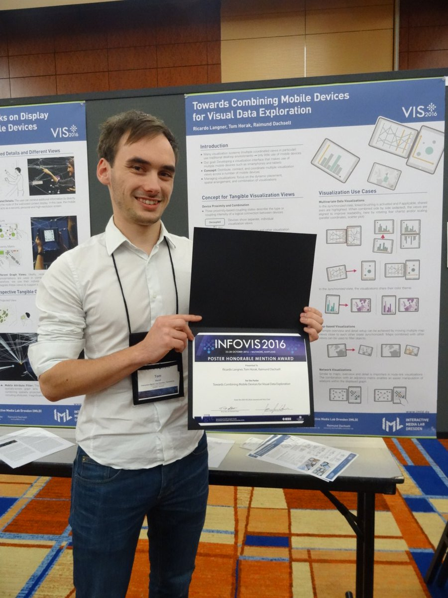
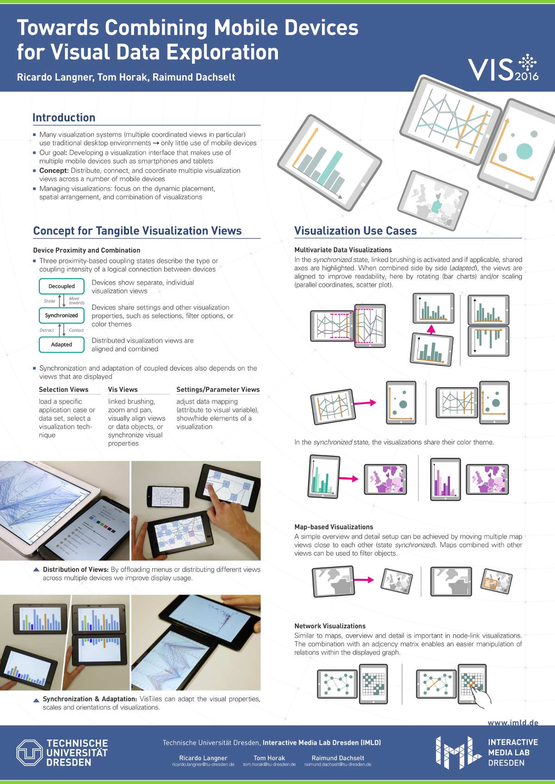

## Honorable Mention
We are really happy and proud that we have received an honorable mention for this work!

{:style="max-width:400px"}

## Video
Our video from the fast-forward session at the IEEE VIS conference can be found on [vimeo](https://vimeo.com/182985048).

## Poster
This work was presented as a poster at the IEEE VIS 2016 conference ([PDF-Download](https://imld.de/cnt/uploads/Langner-2016-Mobile_Vis_Views-Poster.pdf)):

{:style="width:100%"}